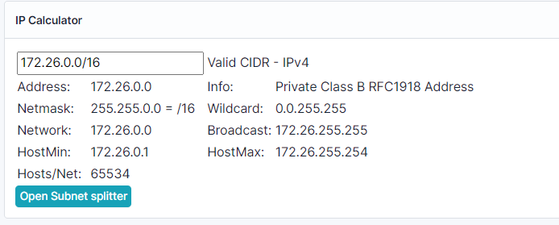
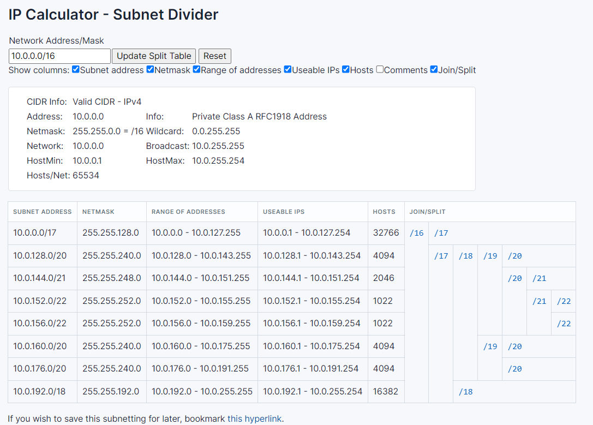

# IP Calculator

The calculator is JavaScript based and refreshes as you type. It will calculate the
- IP Address
- Network mask
- Wildcard
- Network address
- Broadcast address
- First Host IP
- Last Host IP Number of Hosts in the network

Both IPv4 and IPv6 are supported

The IP Calculator is added to the views of
- Aggregate
- Prefix
- IP Address

In addition the plugin adds the ability to visualize and share the subnetting of a prefix into smaller subnets

## Installation

| IPCalculater Version | NetBox version | Remarks |
| --- | --- | --- |
| v0.0-1.3 | Netbox <=3.7 | |
| v1.4.x | Netbox >=3.7 | compatible with v3 and v4 |

### Enable the plugin
Update the /opt/netbox/local_requirements.txt with **(referenced with a dash)**

    netbox-ipcalculator

Edit the /opt/netbox/netbox/netbox/configuration.py and add the plugin **(referenced with an underscore)**

    PLUGINS = ['netbox_ipcalculator']

### Activation Option 1 - Install and activite the plugin, with NetBox 'upgrade.sh' script (fast)
Install the plugin 

    /opt/netbox/venv/bin/python3 -m pip install netbox-ipcalculator

collect static files (local jquery copy)

    /opt/netbox/venv/bin/python3 /opt/netbox/netbox/manage.py collectstatic 

### Activation Option 2 - Install the plugin and run the NetBox 'upgrade.sh' (most reliable)
or run the ./upgrade.sh script (takes longer, but assures it will work after upgrades)

    cd /opt/netbox
    ./upgrade.sh

### Restart NetBox
    sudo systemctl restart netbox

---
Thanks to DavidC for the idea and the javascript code of the Prefix join/split https://github.com/davidc/subnets 
