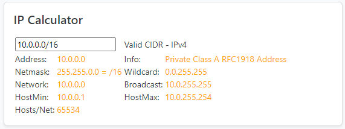

# IP Calculator

Adds an IP Calculator to the views of
- Aggregate
- Prefix
- Ip Address

## Installation

+ v0.0-1.3 --> Netbox <=3.7
+ v1.4 --> Netbox >=3.7

Update the /opt/netbox/local_requirements.txt with **(referenced with a dash)**

> netbox-ipcalculator

Edit the /opt/netbox/netbox/netbox/configuration.py and add the plugin **(referenced with an underscore)**
> PLUGINS = ['netbox_ipcalculator']

run the ./upgrade.sh 
> /opt/netbox# ./upgrade.sh

restart nextbox
> sudo systemctl restart netbox

